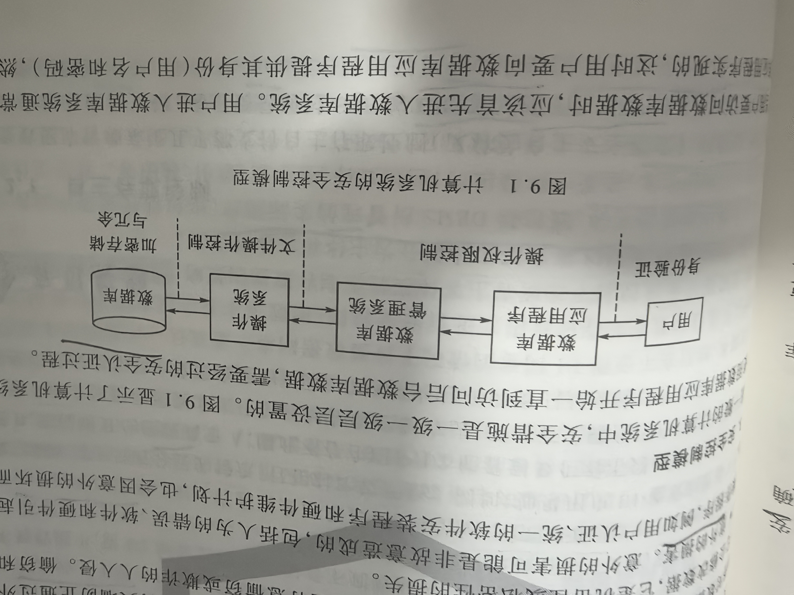

# 9 安全管理

## 专业术语

| 中文 | 英文 | 简称 | 说明 |
| --- | --- | --- | --- |
|  |  |  |  |

## 9.1 安全控制概述

安全性是指：保护数据以防止不合法的使用而造成数据被泄露、更改和破坏；
完整性：数据的准确性和有效性

安全性：保护数据以防止不合法用户故意造成的破坏
完整性：保护数据以防止不合法用户无意中造成的破坏

数据库中的安全控制是指：在数据库系统的不同层层次提供对有意和无意损害行为的安全防范

在数据库中，对「有意的非法活动」可采用「加密存、取数据」的方法控制；
对「有意的非法操作」可使用「用户身份验证」、「限制操作权限」来控制；
对「无意损坏」可采用提高系统的「可靠性」和「数据备份」等方法来控制。

**1. 数据库安全控制的目标**
目标：保护数据免受意外或故意的丢失、破坏或滥用。
数据库管理员（DBA）负责数据库系统的全部安全。

**2. 数据库安制的威胁**
全面的「数据库安全计划」考虑的情况
1. 可用性的损失
2. 机密性数据的损失
3. 私密性数据的损失
4. 偷窃和欺诈
5. 意外的损害

**3. 安全控制模型**



**4. 授权和认证**
授权是将合法访问数据库或数据库对象的权限授予用户的过程

认证是一种鉴定用户身份的机制。
其他认证模式：挑战-应答系统、数字签名

数据库安全访问的控制方法：
1. 自主存取控制：
2. 强制存取控制：分层特点。数据对象标有密级，每一个用户也被授予一个许可证级别

不管采用自主存取控制还是强制存取控制，所有有关哪些用户可以对那些数据对象进行操作的决定都是由「政策」决定的，DBMS只是实施这些决定。

## 9.2 存取控制

### 9.2.1 自主存取控制
又称为：自主安全模式。
主要通过SQL的CREANT(授予)、REVOKE(收回)、DENY(拒绝)语句来实现的。
授予和收回权限是数据库管理员（DBA）的职责。

**1. 权限种类**

1. 对数据库管理系统进行维护的权限：
2. 对数据库中的对象和数据进行操作的权限
    > 1. 对数据库对象的操作权限（语句权限）：包括创建、删除和修改数据库兑现
    > 2. 对数据库数据的操作权限（对象权限）：包括对表、视图数据的增、删、改、查权限，存储过程的执行权等

**2. 用户分类**

1. 系统管理员：拥有全部权限
2. 数据库对象拥有者
3. 普通用户

### 9.2.2 强制存取控制

在强制存取控制中，DBMS将全部试题划分为「主体」和「客体」两大类
1. 主体：是系统中的活动实体
2. 客体：是系统中的被动实体

对于主体和客体，DBMS为它们的每个实例指派一个「敏感标记（Label）」。
敏感标记被分为若干级别：
1. 绝密（Top Secret）
2. 秘密（Secret）
3. 可信（Confidential）
4. 公开（Public）

主体的敏感标记称为「许可证级别」；
客体的敏感标记称为「密级」

强制存取控制机制就是对比主体的label和客体的Label，最终确定主体是否能够存取客体。

当某一用户以标记Label注册到系统时，系统要求他对任何客体的存取必须遵循如下规则：
1. 仅当主体的许可证级别>=客体的密级时，该主体才能读取相应的客体
2. 仅当主体的许可证级别=客体的密级时，该主体才能写相应的客体

强制存取控制是对数据本身进行密级标记。
自主存取与强制存取控制共同构成DBMS的安全机制。

通用安全性分级模式，共定义了D/C/B/A四类安全级别，从D到A一次增高
1. D: 最小（Minimal）保护
2. C: 自主（Discretionary）保护
3. B: 强制（Mandatory）保护
4. A: 验证（Verified）保护

(1) 自主保护
C类分为C1和C2，C1安全级别低于C2。每个子类都支持自主存取控制，即存取权限由数据对象的所有者决定
1. C1子类对所有权与存取权限加以区分，虽然它允许用户拥有自己的私有数据，但仍然支持共享数据的概念
2. C2子类还要求通过注册、审计即资源隔离以支持责任说明

(2) 强制保护
B类分为B1、B2和B3，B1安全级别最低，B3最高
1. B1子类要求”标识化安全保护“，并要求每个数据对象都必须标以一定的密级，同时还要求安全策略的非形式化说明
2. B2子类要求安全策略的形式化说明，能识别并消除隐藏通道。隐蔽通道的例子有：从合法查询的结果中推断出不合法查询的结果；通过合法的计算推断出敏感信息
3. B3子类要求支持审计和回复以及指定安全管理者。

(3) 验证保护
A类要求安全机制是可靠的切足够支持对指定的安全策略给出严格的数据证明

支持强制存取控制的DBMS也称为：多级安全性或可信系统

## 9.3 审计跟踪

审计跟踪实质上是一种「特殊的文件或数据库」，系统在上面自动记录用户对常规数据的所有操作。

典型的审计跟踪记录包含信息：
1. 操作请求
2. 操作终端
3. 操作人
4. 操作日期和时间
5. 元组、属性和影响
6. 旧值
7. 新值

## 9.4 统计数据库的安全性

统计数据库提供基于各种不同标准的统计信息或汇总数据，而统计数据库安全性是用于控制对统计数据库的访问。
统计数据库允许用户查询聚合类型的信息。

数据库安全机制设计的目标：好的安全措施应该是的那些试图破坏安全的人所花费的代价远远超过他们所能得到的利益。

## 9.5 SQL Server的安全控制

### 9.5.1 身份验证模式

1. Windows身份验证模式
2. 混合身份验证模式

### 9.5.2 登录账户

两类登录账户：
1. 由SQL Server自身负责身份验证的登录账户
2. 登录到SQL Server的Windows网络账户，可以是组账户或用户账户

内置系统账户：安装完SQL Server 2008后，系统本身自动创建的登录账户

**1. 建立登录账户**

参数说明：
1. WINDOWS: 指定将登录名映射到Windows用户名
2. PASSWORD='pwd': 仅适用于SQL Server身份验证的登录名。指定新建登录名的密码
3. SID=sid: 仅适用于SQL Server身份验证的登录名。指定新登录名的GUID（全球唯一标识符）。如未选择此项，SQL Server将自动指派GUID
4. DEFAULT_DATABASE=database: 指定新建登录名的默认数据库。默认未master
5. DEFAULT_LANGUAGE=language: 指定新建登录名的默认语言。默认未服务器的当前默认语言

示例：
1、创建SQL Server身份验证的登录账户、登录名为SQL_User1，密码为 123
```sql
CREATE LOGIN SQL_User1 PASSWORD='123'
```

2、创建Windows身份验证的登录账户、从Windows域账户创建[TEST\Win_User2]登录账户
```sql
CREATE LOGIN [TEST\Win_User2] FROM WINDOWS
```

3、创建SQL Server身份验证的登录账户，登录名：SQL_User3，密码：123、要求该登录账户首次连接服务器时必须更改密码
```sql
CREATE LOGIN SQL_User3 WITH PASSWORD='123' MUST_CHANGE
```

**2. 修改登录账户属性**

参数说明：
1. ENABLE | DISABLE: 启用或禁用此登录名
2. OLD_PASSWORD='password': 指定正在更改的登录名密码
3. NAME=login_name: 重命名该登录名的新名称

示例：
1. 启用已禁用的登录账户
```sql
ALTER LOGIN SQL_User1 ENABLE
```

2. 更改登录账户的密码
```sql
ALTER LOGIN SQL_User1 WITH PASSWORD='1233'
```

3. 更改登录账户名，将登录账户名改为newuser
```sql
ALTER LOGIN SQL_User1 WITH NAME=newuser
```

**3. 删除登录账户**

删除之前应该先将登录账户在各个数据库中映射的数据库用户删除掉（如果有的话）

语法：
```sql
DROP LOGIN login_name
```

示例：
1. 删除SQL_User1登录账户
```sql
DROP LOGIN SQL_User1
```

### 9.5.3 数据库用户

数据库用户一般都来自服务器上已有的登录账户，让登录账户成为数据库用户的操作称为「映射」。

**1. 建立数据库用户**

参数说明：
1. LOGIN login_name: 指定要映射为数据库用的SQL Server登录名。login_name必须是服务器中有效的登录名

示例：
1. 使SQL_User2登录账户成为某数据库中的用户，并且用户名同登录名
```sql
CREATE USER SQL_User2
```

2. 先创建名为SQL_JWC且具有密码的SQL Serve身份验证的服务器登录名，然后在test数据库中创建此登录名对应的数据库用户JWC
```sql
CREATE LOGIN SQL_JWC WITH PASSWORD='123'
GO
USE TEST
GO
CREATE USER JWC FOR LOGIN SQL_JWC
GO
```

**2. Guest用户**
Guest是SQL Server中一个特殊的数据库用户，提供给「匿名访问者」使用。

启用guest用户：
```sql
GRANT CONNECT TO guest
```

禁用guest用户
```sql
REVOKE CONNECT TO guest
```

注意：
每个数据库中还有一个特殊用户：dbo（database owner）。是创建该数据库的登录账户映射到数据库中的用户，其所创建的对象都是dbo.对象名

**3. 删除数据库用户**
语法
```sql
DROP USER user_name
```

### 9.5.4 权限管理

为数据库中的用户「授予数据库数据集对象的操作权限」

**1. 对象级别的权限**


1. 授权语句

参数说明：
1. Permission：指定可以授予的对象权限
2. ALL：授予适用于指定对象的所有ANSI-92权限。
    > 标量函数权限：EXECUTE/REFERENCES
    > 表值函数权限：DELETE/INSERT/REFERENCES/SELECT/UPDATE
    > 存储过程权限：EXECUTE
    > 表权限：DELETE/INSERT/REFERENCES/SELECT/UPDATE
    > 视图权限: DELETE/INSERT/REFERENCES/SELECT/UPDATE
3. PRIVILEGES: 包含此参数是为了符合ANSI-92标准
4. ON [OBJECT::][schema_name].object_name:指定被授予权限的对象
5. TO <datebase_principal>: 指定要向授予权限的主体，可以是数据库用户名，也可以是用户定义的角色名
6. WITH GRANT OPTION: 指示该主体还可以向其他主题授予所制定的权限
7. Column: 指定表、视图或表值函数中将被授予权限的列名。只能在Select、references、update操作上对列进行授权

示例
1. 授予用户RosaQdM对Address表具有select权限
```sql
CRANT SELECT ON Address TO RosaQdM
```

2. 授予用户RosaQdM对HumanResources.EmployeeInfo存储过程具有execute权限
```sql
CRANT EXECUTE ON OBJECT::HumanResources.EmployeeInfo TO RosaQdM
```

3. 使用GRANT OPTION选项，授予用户RosaQdM对vEmployee视图中EmployeeID列具有REFERENCES权限
```sql
CRANT REFERENCES(EmployeeID) ON vEmployee TO RosaQdM GRANT OPTION
```

2. 拒绝权限

参数说明
1. CASCADE: 表示拒绝的权限也会被对此主体授予该权限的其他主体拒绝

示例：
1. 拒绝用户RosaQdM对Person.Address表具有select权限
```sql
DENY SELECT ON OBJECT::Persion.Address TO RosaQdM
```

2. 拒绝用户RosaQdM 对 HumanResources.EmployeeInfo存储过程具有execute权限
```sql
DENY EXECUTE ON HumanResources.EmployeeInfo TO RosaQdM
```

3. 使用CASCADE选项。拒绝用户RosaQdM对 HumanResources.vEmployee视图中 EmployeeID 列具有references权限
```sql
DENY REFERENCES(EmployeeID) ON OBJECT::HumanResources.vEmployee TO RosaQdM CASCADE
```

3. 收权语句

参数说明
1. CASCADE: 表示撤销的权限也会被对此主体授予该权限的其他主体撤销

示例：
1. 撤销用户 RosaQdM 对Person.Address 表的 select权限
```sql
REVOKE SELECT ON OBJECT::Person.Address FROM RosaQdM
```

2. 撤销用户 RosaQdM 对 HumanResources.EmployeeInfo 存储过程的 execute 权限
```sql
REVOKE EXECUTE ON HumanResources.EmployeeInfo FROM RosaQdM
```

**2. 语句级别的权限**

语句：
1. CREATE DATABASE
2. CREATE PROCEDURE
3. CREATE TABLE
4. CREATE VIEW
5. CREATE FUNCTION
6. BACKUP DATABASE
7. BACKUP LOG

1. 授权语句

示例：
1. 授予用户 RosaQdM 具有创建表的权限
```sql
GRANT CREATE TABLE TO RosaQdM
```

2. 授予用户 user1 和user2 都具有 创建表和视图的权限
```sql
GRANT CRAETE TABLE,CRAETE VIEW TO user1,user2
```

2. 拒绝权限

示例：
1. 拒绝用户user1具有创建视图的权限
```sql
DENY CREATE VIEW TO user1
```

3. 收权语句

示例:
1. 收回用户 RosaQdM 创建表的权限
```sql
REVOKE CREATE TABLE FROM RosaQdM
```

### 9.5.5 角色

具有相同权限的用户就称为角色

角色分为：
1. 预定义的系统角色：  
2. 用户定义的角色：

系统角色分为：
1. 服务器级别角色（固定服务器角色）
2. 数据库级角色（固定数据库角色）

用户定义的角色均是：数据库级角色

**1. 固定服务器角色**

固定服务器角色的作用域属于服务器范围，
用户不能添加。删除或更改固定服务器角色


还有一个系统预定义服务器角色：public

1. 为固定服务器角色添加成员

语法：
```sql
sp_addsrvrolemember [@loginname=]'login', [@rolename=]'role'
```

参数说明
1. [@loginname=]'login'：要添加到固定服务器角色中的登录名
2. [@rolename=]'role'：要添加到固定服务器角色的名称，默认null

返回值：
0：成功
1：失败

示例：
1. 将Windows身份验证的TEST\Win_User1登录名添加到sysadmin角色中
```sql
exec sp_addsrvrolemember 'TEST\Win_User1', 'sysadmin'
```

2. 将SQL身份验证的SQL_User2登录名添加到 dbcreator 角色中
```sql
exec sp_addsrvrolemember 'SQL_User2', 'dbcreator'
```

2. 删除固定服务器角色成员
语法：
```sql
sp_dropsrvrolemember [@loginname=]'login', [@rolename=]'role'
```
示例：
1. 从dbcreator 角色中删除SQL_User2登录名
```sql
exec sp_dropsrvrolemember 'SQL_User2', 'dbcreator'
```

**2. 固定数据库角色**

固定数据库角色是定义在数据库级别上的。
用户不能添加、删除或更改固定数据库角色。


1. 为固定数据库角色添加成员

语法：
```sql
sp_addrolemember [@rolename=]'role', [@membername=]'security_account'
```

参数说明
1. [@rolename=]'role': 当前数据库中的数据库角色名
2. [@membername=]'security_account'：要添加到角色中的数据库用户名

返回值：
0：成功
1：失败

示例：
1. 将Windows身份验证的TEST\Win_User1登录名添加到当前数据库中的sysadmin角色中
```sql
exec sp_addrolemember 'sysadmin', 'TEST\Win_User1'
```

2. 将SQL身份验证的SQL_User2登录名添加到 dbcreator 角色中
```sql
exec sp_addrolemember 'dbcreator', 'SQL_User2'
```

2. 删除固定数据库角色成员
语法：
```sql
sp_droprolemember [@rolename=]'role', [@membername=]'security_account'
```
返回值：
0：成功
1：失败

示例：
1. 
```sql
exec sp_droprolemember 'sysadmin', 'SQL_User2'
```

**3. 用户定义的角色**

用户定义的角色属于数据库一级的角色

1. 创建用户定义的角色
语法：
```sql
CREATE ROLE role_name [AUTHORIZATION owner_name]
```

参数说明
1. role_name: 待创建角色的名称
2. AUTHORIZATION owner_name: 将拥有新角色的数据库用户或角色。如果为指定用户，则执行create role的用户将拥有该角色

示例
1. 在当前数据库中创建用户自定义角色 role1,其拥有者为创建该角色的用户
```sql
CREATE ROLE role1
```

2. 在当前数据库中创建用户自定义角色 role2，其拥有者为 SQL_User1
```sql
CREATE ROLE role2 AUTHORIZATION SQL_User1
```

3. 在当前数据库中创建用户自定义角色 role3，其拥有者为 SQL_User2角色
```sql
CREATE ROLE role3 AUTHORIZATION SQL_User2
```


2. 为用户定义的角色授权
使用T-SQL语句，与实现对数据库用户授权完全一样

3. 添加和删除用户定义的角色中的成员
使用的语与为固定数据库角色添加和删除成员完全一样

4. 删除用户定义的角色
语法：
```sql
DROP ROLE role_name
```

不能从数据库中删除拥有安全对象的角色。
若要删除拥有安全对象的数据库角色，必须首先移除这些安全对象的所有权，或从数据库中删除这些安全对象。
不能从数据库中删除拥有成员的橘色，若要删除，必须首先删除角色中的成员。

示例
```sql
DROP ROLE role1
```


### 9.5.
### 9.5.


## 9.6 Oracle的安全管理
