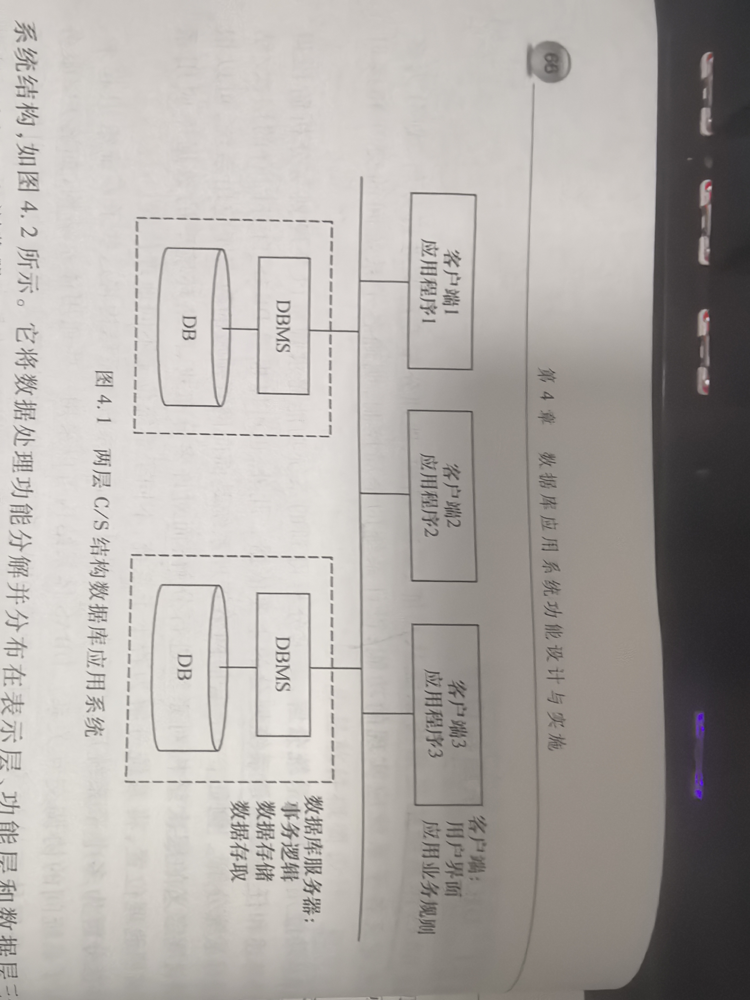
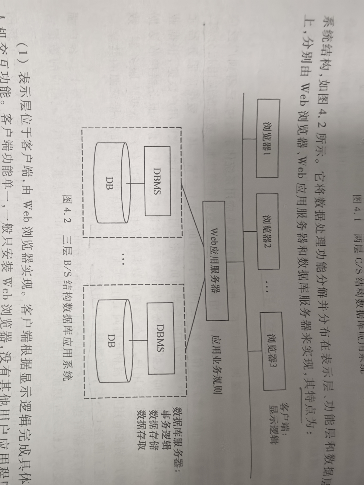
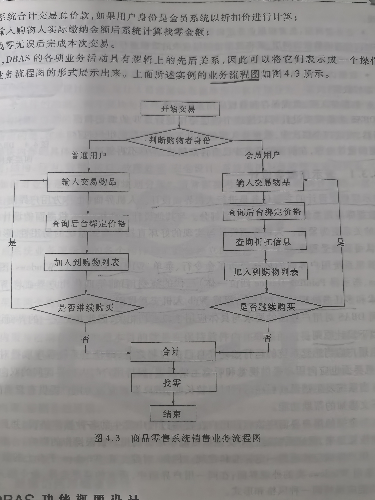

## 专业术语

| 中文 | 英文 | 简称 | 说明 |
| --- | --- | --- | --- |
|  |  |  |  |

## 4.1 软件体系结构与设计过程

### 4.1.1 软件体系结构

软件体系结构（又称：软件架构）：= { 构件，连接件， 约束 }
构件：组成系统的具有一定独立功能的不同粒度的程序模块、独立程序或软件子系统，是组成软件的系统元素；
连接件：将不同的构件连接起来，表示构件间的相互作用，如信号量的传递、功能和方法的调用、数据传送和转换、构件间的同步等；

构件可以是过程调佣、管道、远程过程调用等；
约束一般为对象链接是的规则，或指明了构件连接的条件。

软件体系结构的风格和类型：
分层体系结构；
模型-视图-控制器（MVC）体系结构；
客户/服务器体系结构

### 4.1.2 软件设计过程

软件开发组成 = 设计 + 实现 + 测试
设计又包括：概要设计 + 详细设计

软件设计阶段产生：系统的总体结构设计（或称体系结构设计）、系统的过程设计、系统的数据设计；
总体结构设计：旨在确定组成软件系统的各主要部件及其相互间关系
过程设计：完成对每一部分的过程化描述；
数据设计：定义了为实现软件所需要的数据结构

软件设计过程中应遵循的原则：
设计应与软件需求保持一致，设计的软件结构应支持模块化、信息隐藏、抽象与逐步求精等

从工程管理角度，软件设计课分为概要设计和详细设计

概要设计：根据需求确定软件和数据的总体框架；
详细设计：将其进一步细化成软件的算法表示和数据结构

**1. 概要设计**

概要设计任务：建立软件系统的总体结构和模块间的关系，定义个功能模块的接口，设计全局数据库或数据结构，规定设计约束，指定测试计划。

好的概要设计要求：良好的总体结构，功能模块间较低的耦合度和功能模块内较高的内聚度，并尽量降低模块接口的复杂性

**2. 详细设计**

概要设计侧重于模块的外部功能描述和模块间接口关系
详细设计则是细化概要设计产生的功能模块，形成可编程的程序模块。

软件设计可选用 结构化设计方法（面向数据流的设计方法）、面相对象设计方法、面相数据设计方法

**3. 关于软件总体设计**

概要设计的目标：产生软件总体结构和软件功能模块

概要设计分为两个步骤：
1. 软件总体结构设计
2. 将每个子系统进一步划分为功能模块，定义各功能模块的数据结构、相互间交互关系。

大型复杂系统层次结构：系统-子系统-模块-子模块

## 4.2 DBAS总体设计

原则：自上而下、循序渐进、逐步求精

DBAS设计：结构设计、过程设计、数据设计

### 4.2.1 DBAS体系结构设计

DBAS体系结构是将系统从功能、层次/结构、地理分布等角度进行分解，划分为多个子系统，定义各子系统应实现的功能。
设计系统的全局控制，明确各子系统间的交互和接口关系

**1、 客户/服务器（C/S）体系结构**

**2、 浏览器/服务器（B/S）体系结构**

### 4.2.2 DBAS软件总体设计

DBAS软件包括操作系统、数据库管理系统、开发环境、中间件和应用软件
应用软件分为：数据库事务和应用程序
数据库事务通过对数据库的直接操作实现数据管理和数据处理功能
应用程序：
一方面可以与数据库事务相互协调合作，对数据库中的应用数据进行进一步加工处理
另一方面从这些数据中抽取新的信息，以实现复杂的数据处理功能

应用软件总体设计得到的系统总体结构和分层模块结构可以用模块结构图表示

模块结构图主要关心模块的外部特性。
模块结构图 = 模块、调用、数据、控制、转接 无中基本符号组成

应用软件总体设计之后的设计工作分别是：数据库事务和应用程序的概要设计和详细设计

### 4.2.3 软硬件选型与配置设计

DBAS总体设计阶段需要对系统硬件平台和存储设备、操作系统、数据库管理系统等作出合理选择，并进行初步配置设计

软硬件选型设计的内容：
1. 网络及网络设备选型
2. 数据出处设备及备份方案制定
3. 应用服务器、web服务器选型
4. 确定系统终端软件环境
5. 确定软件平台及开发语言、工具
6. 系统中间件及第三方软件选型

进行软硬件选型及配置设计需要考虑的因素
1. 数据规模
2. 系统性能
3. 安全可靠性
4. 用户需求
5. 项目预算情况

### 4.2.4 业务规则初步设计

使用流程图

## 4.3 DBAS功能概要设计

### 4.3.1 表示层概要设计

### 4.3.2 业务逻辑层概要设计 

### 4.3.3 数据访问层概要设计

## 4.4 DBAS功能详细设计

### 4.4.1 表示层详细设计

### 4.4.2 业务逻辑层详细设计

## 4.5 应用系统安全架构设计

### 4.5.1 数据安全设计

### 4.5.2 环境安全设计

### 4.5.3 制度安全设计

## 4.6 DBAS试试

### 4.6.1 创建数据库

### 4.6.2 数据装载

### 4.6.3 编写与调试应用程序

### 4.6.4 数据库系统试运行

